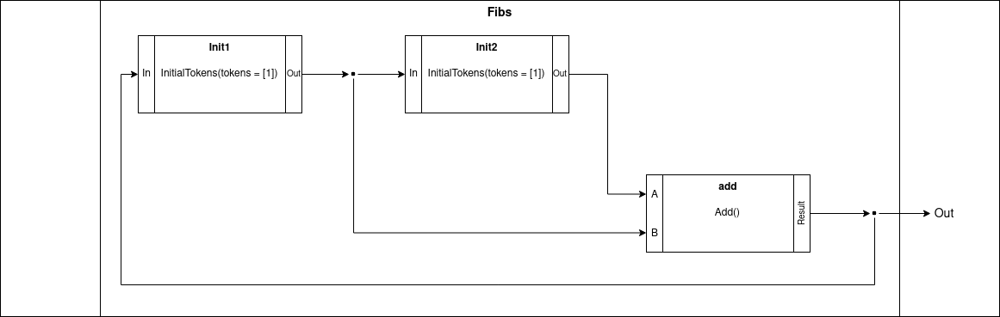

[](https://coveralls.io/github/streamblocks/streamblocks-graalvm?branch=master)
# StreamBlocks GraalVM - CAL implementation in GraalVM
StreamBlocks-GraalVM is an implementation of the [CAL Actor Language](https://en.wikipedia.org/wiki/CAL_Actor_Language) (described below) over [GraalVM](https://www.graalvm.org/) using the [Truffle Framework](https://www.graalvm.org/graalvm-as-a-platform/language-implementation-framework/).

## Getting Started
### Getting started with the language
For a quick introduction to the language, look at [Introduction to the CAL Actor Language](#introduction-to-the-cal-actor-language) and for a more detailed introduction, read through [Gentle Introduction to CAL](doc/GentleIntro.pdf).

### Installation
See the documentation on the GraalVM website on how to [get GraalVM](https://www.graalvm.org/docs/getting-started/). ```Streamblocks-Graalvm``` is currently using GraalVM 21.3.0. 

Once GraalVM has been installed from the above link, along with setting of the environment variables ```JAVA_HOME
``` and ```PATH```, cd into the project root and execute
```
git clone https://github.com/streamblocks/streamblocks-graalvm/
cd streamblocks-graalvm
mvn package
```

### Running CAL Programs
CAL programs can be run as follows:
```bash
./cal --cal.entity-qid=<actor to execute> <path to program>
```
Other options that can be specified:
```
--cal.directory-lookup=<If program is distributed across multiple files. All the CAL files in the directory of path are parsed>
--cal.iterations=<If passed, run the root actor for given number of iterations>
```
For example, To execute the ```Hello, World``` program [```language/tests/println.cal```](language/tests/println.cal):
```bash
./cal --cal.entity-qid=test.helloworld --cal.iterations=1 language/tests/println.cal
```

## Introduction to the CAL Actor Language
CAL is a high-level programming language for writing [dataflow actors](https://en.wikipedia.org/wiki/Dataflow_programming).

> *Dataflow Actors are [stateful](https://en.wikipedia.org/wiki/State_(computer_science)) operators that transform input streams of data objects (tokens) into output streams.*

In other words, a ```Dataflow Actor```:
1. Is connected to (possibly multiple) streams of data (for example, a list of integers) where each element is called a ```token```
2. Is an ```operator``` - It performs certain computations/transformations on the data received in the input streams and makes the output available as another stream of data. In this process, it removes ```token(s)``` from the input streams and adds ```token(s)``` to the output streams.
3. Is ```stateful``` - It can store information across different executions. For example, a counter to keep track of the total number of elements processed, or to maintain a cumulative/running sum.

CAL has been used in several application areas, including video and processing, compression and cryptography. The MPEG Reconfigurable Video Coding working group has adopted CAL as part of their standardization efforts.

A good guide for whether CAL is suitable for a problem, is whether a description of the computation itself starts with a diagram of blocks connected by arrows that denote transmission  of packets of information.

### The Actor Model
* A CAL Program consists of different ```Actors```
* Each Actor consists of
  * Named Input and Output ```port(s)```
  * Internal State (Variable bindings)
  * Several code blocks called ```Actions```. ```Action``` defines:
    * Number of ```token(s)``` to be fetched from the various ports
    * Computation to be performed on input tokens
    * Corresponding modifications to be made to the state variables
    * Output ```token(s)``` to be written
* The input and output ports of Actors in a program can be connected via data streams
* Actors perform their computation in a sequence of steps called firings
* In each firing, one ```action``` within the actor is selected for execution, based on the various [Action Selection constructs provided in CAL](#action-selection)

### Example Programs in CAL
Consider the following actor, which has 2 Input ports(`In1` and `In2`) and one Output port(`Out`), and the computation performed is simply adding the 2 numbers.


This actor can be expressed in CAL(replacing `In1` and `In2` with `A` and `B` respectively) as:
```
actor Add () A, B ==> Out:
    Counter := 0;
    action [a], [b] ==> [a + b]
    do
        Counter := Counter + 1;
    end
end
```

Let's add another Actor to our vocabulary:
```
actor InitialTokens (tokens) In ==> Out:
    A: action ==> [tokens] repeat #tokens end
    B: action [a] ==> [a] do end
    schedule fsm s0:
        s0 (A) --> s1;
        s1 (B) --> s1;
    end
end
```
This actor takes a list `tokens` as parameter, and writes it to the output port, after which, it copies over tokens from its `In` port to `Out` port. `schedule fsm` is an [Action Selection constructs provided in CAL](#action-selection), and is used to define the actor as a [Finite State Machine](https://en.wikipedia.org/wiki/Finite-state_machine) and describing the transitions that can be made from state to state, depending on execution of actions. Specifically, this actor has an initial state ```s0``` and only the action tagged ```A``` can execute from the initial state, after which the only action that can execute is ```B``` since the state remains ```s1``` after that. The action tagged ```A``` writes the elements in the list ```tokens``` to the output port and the action tagged ```B``` simply copies over the ```tokens``` from ```In``` to ```Out```.

CAL provides 2 ways to define an Actor:
* Create an Actor out of actions as seen for `Add` and `InitialTokens` above
* Combine various actors and define connections between them within a block called a `Network`

We can combine the 2 actors defined above into a structure that calculates the [Fibonacci Series](https://en.wikipedia.org/wiki/Fibonacci_series):


The above arrangement of Actors can be realized in CAL as a Network:
```
network Fibs () ==> Out:
entities
    init1 = InitialTokens(tokens = [1]);
    init2 = InitialTokens(tokens = [1]);
    add = Add();
structure
    init1.Out --> init2.In;
    init1.Out --> add.A;
    init2.Out --> add.B;
    add.Result --> init1.In;
    add.Result --> Out;
end
```

The Fibonacci Series is created by summing the last 2 elements. What about a series summing the last 5 elements in sequence?
```
network Fibs5 () ==> Out:
entities
  init1 = InitialTokens(tokens = [1]);
  init2 = InitialTokens(tokens = [1]);
  init3 = InitialTokens(tokens = [1]);
  init4 = InitialTokens(tokens = [1]);
  init5 = InitialTokens(tokens = [1]);
  add1 = Add();
  add2 = Add();
  add3 = Add();
  add4 = Add();
structure
  init1.Out --> init2.In;
  ...
  init1.Out --> add1.A;
  init2.Out --> add1.B;
  ... 
  Describe more connections
  ...
end
```

Let's generalize the program to sum of last N elements:
```
network FibsN (N) ==> Out:
    entities
        init = [InitialTokens(tokens = [1]) : for i in 1 .. N];
        add = [Add() : for i in 2 .. N];
    structure
        foreach i in 1 .. N-1 do
            init[i-1].Out --> init[i].In;
        end
        foreach j in 0 .. N-2 do
            if j = 0 then
                init[0].Out --> add[j].A;
            else
                add[j-1].Result --> add[j].A;
            end
            init[j+1].Out --> add[j].B;
        end
        add[N-2].Result --> init[0].In;
        add[N-2].Result --> Out;
end
```
The above program demonstrates use of list-comprehensions and if-statements to define the structure of the network.

Examples of programs in CAL demonstrating the various supported constructs are available under [language/tests](language/tests/).

## Language Specification
### Formal Language Specifications:
1. CAL Actor Language can be found at [doc/Language_Specification/CLR.pdf](doc/Language_Specification/CLR.pdf)
2. CAL Network Language can be found at [doc/Language_Specification/NL.pdf](doc/Language_Specification/NL.pdf)

### ANTLR4 based Grammar
The ANTLR4 based Grammar used for parsing CAL Programs is available at [language/src/main/antlr4/ch/epfl/vlsc/truffle/cal/parser](language/src/main/antlr4/ch/epfl/vlsc/truffle/cal/parser)

## Project Status
### Program Structure
#### Namespace and Imports
 - [x] Multiple files
 - [x] Named imports
 - [x] Import all, currently we are parsing all the files but this need to be done with a DAG in order to have the entities to import with all
 - [x] Import functions and global variables
 - [ ] Time

### Actions
 - [x] Basic support
 - [x] Simple, single-port input pattern
 - [X] repeat, lacking proper multiport support
 - [x] Other input patterns
 - [x] Simple, single-port output expressions
 - [ ] Delays
 - [x] Guards
 - [x] Priorities

### Satements/Expressions
 - [x] Assignments
 - [x] Calls
 - [x] Lambdas
 - [x] most literals
 - [x] if
 - [x] for, doesn't support multiple var decls and probably othe little things, comprehensions lack filter support
 - [x] while
 - [ ] choose
 - [x] +, -, \*, /,
 - [x] # (list size)

### Types
 - [x] Numbers, all implemented as BigNumbers
 - [x] List, room for improvements does not subtype Seq and Collection
 - [x] Strings, does not subtype List[Character] yet
 - [ ] Seq
 - [ ] Collection
 - [ ] Map
 - [ ] Set
 - [ ] Character
 - [ ] Boolean
 - [ ] Null
 - [ ] Custom types

### Actor
 - [x] Simple execution
 - [x] FSM-action selection

### Network
 - [x] Simple execution

### Action Selection
 - [ ] Guards
 - [ ] Priorities
 - [ ] Schedules
   - [ ] FSM
   - [ ] Regex

## Development
The Development environment can be setup by installing [IntelliJ](https://www.jetbrains.com/idea/). Once installed, import the project as Maven project on IntelliJ. To be able to execute the testsuite from within IntelliJ:
1. Open IntelliJ
2. Goto Run > Edit Configurations
3. Select "CALSimpleTestSuite"
4. Under "Build and Run", select an appropriate JRE